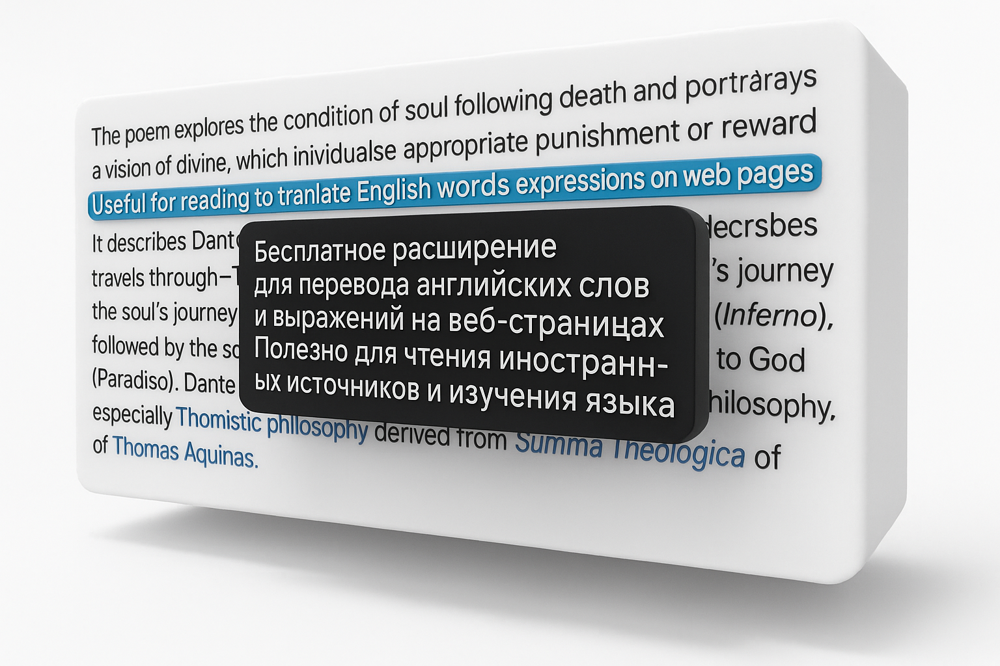
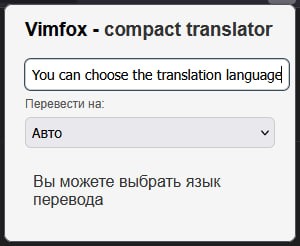

# VimFox – Compact Translator for Firefox  
<!-- **_Vimbox для Firefox, которого не хватало._** -->

<!-- 

  

 -->

<!-- 
    <em>VimFox — удобство в переводе, в любой вкладке Firefox</em> 
 -->

  
   
  <em>VimFox — удобство в переводе, в любой вкладке Firefox</em>

## 🔍 Что это такое?

**VimFox** — это удобное и лёгкое расширение-переводчик для Firefox, вдохновлённое [Vimbox](https://vimbox.skyeng.ru/) из Chrome, но адаптированное для Mozilla Firefox.

> Если ты читаешь технические статьи, общаешься в чатах, учишь английский или просто хочешь мгновенно переводить слова — **VimFox** сделан для тебя.

  
   
  <em>Перевод без лишних действий — прямо на странице, в удобном формате</em>

## 🧩 Возможности

- 📌 **Мгновенный перевод** по выделению текста или наведению
- 🌐 **Контекстное окно** прямо на странице <!-- - 📖 **Поддержка нескольких языков** -->
- 🎯 **Минималистичный UI** (в духе Vimbox)
- 🧠 Подходит для изучения английского языка
- ⚙️ Легковесность, приватность и локальная работа

## 💡 Зачем я это сделал

> ❝ Firefox долгое время оставался без удобного встроенного переводчика, не требующего лишних действий и сторонних сервисов. ❞

Я часто читаю технические статьи, документацию и англоязычные форумы, и нередко возникает необходимость быстро вспомнить значение уже знакомого, но подзабытого слова.  
Большинство расширений на рынке требуют кучу кликов, переходов, перегружены интерфейсом — а некоторые и вовсе открывают сторонние сайты, вроде DeepL или Google Translate.

Мне же хотелось чего-то простого:
- 🔄 чтобы **перевод появлялся сразу**, по выделению или наведению,
- ⏱️ чтобы **не тратить время на загрузки и окна**,
- 🧘‍♂️ чтобы **не отвлекаться от чтения**.

Когда я перешёл на Firefox, оказалось, что нужного инструмента просто нет — ни в магазине, ни среди неофициальных портов. Это и стало поводом создать **VimFox** — расширение, которое даёт мгновенный перевод прямо в контексте страницы, с минималистичным интерфейсом.

Теперь я хочу, чтобы **любой пользователь Firefox и его форков** мог получать перевод быстро и удобно — без лишней суеты.

[🧩 VimFox TaskBoard](https://github.com/users/Avdushin/projects/18)

---

### 🔄 Хочешь помочь?

Если ты тоже когда-то страдал без Vimbox — форкни, улучши или предложи идею. Сделаем VimFox лучше вместе.

## 🖼️ Примеры использования

  
   
  <em>Пример перевода прямо на странице</em>

  
   
  <em>Простой, понятный интерфейс</em>

<!-- --- -->

<!-- ## 🚀 Установка  -->

